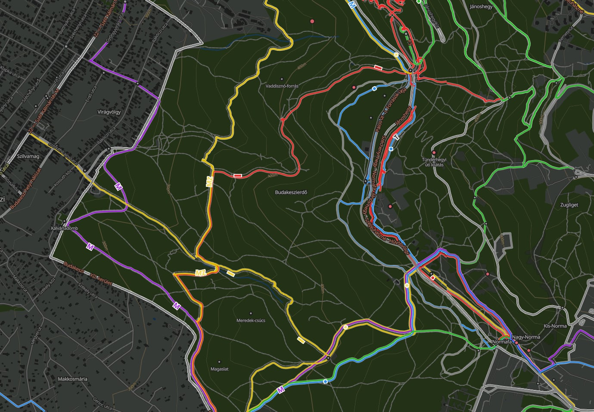

# Hungarian Hiking Maps with PMTiles - Docker Edition

A complete Docker-based solution for generating and serving Hungarian hiking trail vector tiles using PMTiles, Tilemaker, and nginx.



## Features

- **Zero Installation**: Uses Docker containers for all tools (no manual compilation needed)
- **Simple Scripts**: Download and generate tiles with a single command
- **Production Ready**: nginx server with proper CORS and range request support
- **MapLibre Integration**: Includes a working web viewer with visual style editor support
- **Lightweight**: Efficient PMTiles format reduces bandwidth and storage
- **Self-hosted Fonts**: No external dependencies for map labels
- **Topographic Maps**: Optional elevation contour lines (20m intervals)
- **Garmin Device Maps**: Generate installable IMG files for GPS devices (NEW!)

## Quick Start

### Prerequisites

- Docker or Podman installed (with compose support)
- At least 4GB RAM (8GB recommended)
- 20GB free disk space
- Internet connection for downloading OSM data

### Step 1: Download OSM Data

```bash
./scripts/download.sh
```

This downloads the latest Hungarian OpenStreetMap data (~500MB) from Geofabrik.

### Step 2: Generate Tiles

```bash
./scripts/generate-tiles.sh
```

This script:
1. Runs Tilemaker in Docker to generate MBTiles (10-30 minutes)
2. Converts MBTiles to PMTiles format
3. Verifies the PMTiles file
4. Cleans up temporary files

The final `hungary-hiking.pmtiles` file will be 2-6GB depending on detail level.

### Step 3: Start the Server

```bash
podman compose up -d
```

This starts an nginx server on port 8080.

### Step 4: View Your Map

Open your browser and navigate to:
- **Map Viewer**: http://localhost:8080
- **Direct PMTiles**: http://localhost:8080/tiles/hungary-hiking.pmtiles

## Directory Structure

```
pmtiles-server/
├── config/                    # Tilemaker configuration
│   ├── config-hiking.json    # Layer definitions and zoom levels
│   └── process-hiking.lua    # Processing logic for trails, POIs, etc.
├── data/                     # Downloaded OSM data
│   └── hungary-latest.osm.pbf
├── tiles/                    # Generated PMTiles (served by nginx)
│   └── hungary-hiking.pmtiles
├── www/                      # Web viewer and assets
│   └── index.html           # MapLibre GL JS viewer
├── nginx/                    # nginx configuration
│   └── nginx.conf           # Server config with CORS and range requests
├── scripts/                  # Utility scripts
│   ├── download.sh          # Download OSM data
│   └── generate-tiles.sh    # Generate tiles using Docker
├── docker-compose.yml        # Docker Compose configuration
└── README.md                # This file
```

## Configuration

### Customizing Tile Generation

Edit the configuration files before running `generate-tiles.sh`:

#### `config/config-hiking.json`
- Adjust zoom levels (minzoom/maxzoom)
- Enable/disable layers
- Change compression settings

#### `config/process-hiking.lua`
- Add custom POI types
- Modify trail filtering
- Change attribute extraction

### Restricting Tile Access by Referrer

To prevent unauthorized sites from using your tiles, configure allowed referrer domains:

1. Copy the example environment file:
   ```bash
   cp .env.example .env
   ```

2. Edit `.env` and set your allowed domains:
   ```bash
   ALLOWED_REFERRERS=localhost 127.0.0.1 yourdomain.com www.yourdomain.com
   ```

3. Restart the server:
   ```bash
   podman compose restart
   ```

The nginx server will only serve tiles to requests from these domains. This helps prevent bandwidth theft.

### Changing the Port

Edit `docker-compose.yml` and change the port mapping:

```yaml
ports:
  - "YOUR_PORT:80"  # Change YOUR_PORT to desired port
```

Then update the PMTiles URL in `www/index.html`:

```javascript
url: 'pmtiles://http://localhost:YOUR_PORT/tiles/hungary-hiking.pmtiles'
```

### Customizing the Map Style

The map style is in `www/style.json` and can be edited:

**Visual Editor (Recommended):**
1. Open https://maputnik.github.io/editor/
2. Load `http://localhost:8080/style.json`
3. Edit visually (colors, widths, layers, etc.)
4. Export and replace `www/style.json`

**Manual Editing:**
```bash
nano www/style.json  # Edit the JSON directly
```

See `STYLE-EDITING.md` for a complete guide with examples and tips.

## Generating Garmin Device Maps (NEW!)

Create installable maps for Garmin GPS devices from the same OSM data:

```bash
# One-time: Build the Garmin tools container
make garmin-image

# Generate Garmin IMG map file
make garmin

# Install to connected device
./scripts/garmin/install-to-device.sh
```

The generated `gmapsupp.img` file (~400-600MB) can be copied to any compatible Garmin device (eTrex, Oregon, Montana, GPSMAP series).

**Benefits:**
- Same trail data as web map
- Offline navigation on dedicated GPS hardware
- Optional routing support
- Works in BaseCamp for route planning

See `GARMIN-MAPS.md` for complete documentation, customization options, and troubleshooting.

## Adding Elevation Contours (Optional)

Turn your hiking map into a full topographic map with elevation contour lines:

```bash
# Generate contour lines (20m intervals)
make contours

# Or do everything at once (OSM data + contours)
make topo
```

This adds elevation lines showing terrain shape. See `CONTOURS.md` for:
- Complete setup instructions
- Style configuration examples
- Customization options (intervals, colors, styling)

**File sizes:** Contours add ~100-150MB to your tiles.

## Updating Your Tiles

To regenerate tiles with the latest OSM data:

```bash
# Download latest data
./scripts/download.sh

# Regenerate tiles
./scripts/generate-tiles.sh

# Restart nginx to ensure fresh tiles are served
podman compose restart
```

## Container Images Used

Works with both Docker and Podman:

- **Tilemaker**: `ghcr.io/systemed/tilemaker:master`
- **PMTiles**: `ghcr.io/protomaps/go-pmtiles:latest`
- **nginx**: `nginx:alpine`

## Managing the Server

```bash
# Start the server
podman compose up -d
# or: make up

# Stop the server
podman compose down
# or: make down

# View logs
podman compose logs -f
# or: make logs

# Restart the server
podman compose restart
# or: make restart
```

Note: These commands work with both `podman compose` and `docker compose`.

## Performance Notes

For 60-80k daily pageviews:
- **Bandwidth**: 10-50KB per page view (PMTiles uses efficient HTTP range requests)
- **Storage**: 2-6GB for all of Hungary at zoom 6-14
- **CPU**: Minimal (nginx serves static files)
- **Memory**: Low (PMTiles don't need to be loaded into memory)

## Deployment to Production

### Option 1: Deploy with HTTPS

1. Copy files to your server
2. Update `docker-compose.yml` to use nginx with SSL (or add a reverse proxy like Caddy/Traefik)
3. Update the PMTiles URL in `www/index.html` to use your domain

### Option 2: Use with Reverse Proxy

If you have an existing reverse proxy (Caddy, Traefik, nginx):

1. Keep the current setup
2. Configure your reverse proxy to forward to port 8080
3. Ensure your proxy passes through Range headers
4. Enable CORS headers in your proxy

Example Caddy configuration:

```
tiles.yourdomain.com {
    reverse_proxy localhost:8080
    header Access-Control-Allow-Origin *
    header Access-Control-Allow-Methods "GET, HEAD, OPTIONS"
    header Access-Control-Allow-Headers "Range"
}
```

## Troubleshooting

### Tiles not loading in browser

Check the browser console for errors. Common issues:
- Wrong URL in `www/index.html` (check the PMTiles URL)
- CORS errors (check nginx logs: `make logs` or `podman compose logs nginx`)
- Range request issues (verify nginx config is loaded correctly)

### Out of memory during tile generation

Reduce maxzoom in `config/config-hiking.json`:
```json
"maxzoom": 13  // Instead of 14
```

Or add swap space on your host system.

### Tiles are too large

Options to reduce size:
- Lower maxzoom level
- Remove some layers from `config-hiking.json`
- Simplify features in `process-hiking.lua`

### Container permission errors

**For Docker users:**
Make sure the Docker daemon is running:
```bash
sudo systemctl status docker
```

If needed, add your user to the docker group:
```bash
sudo usermod -aG docker $USER
# Log out and back in
```

**For Podman users:**
Podman runs rootless by default, no additional setup needed.

## Map Features

The generated hiking map includes:

### Trails Layer
- Paths, footways, cycleways
- Trail markings (Hungarian color codes)
- Surface type and difficulty (SAC scale)
- Trail visibility ratings

### POIs Layer
- Peaks with elevation
- Viewpoints
- Alpine huts and shelters
- Drinking water sources
- Cave entrances

### Base Layers
- Roads (for context)
- Water bodies and waterways
- Forests and landuse
- Buildings
- Administrative boundaries
- Place labels

## License

- **OpenStreetMap data**: © OpenStreetMap contributors, ODbL license
- **Your tiles**: Subject to ODbL - must attribute OSM
- **PMTiles format**: BSD license
- **Tilemaker**: MIT license
- **This setup**: MIT license

## Credits

- [PMTiles](https://github.com/protomaps/PMTiles) by Protomaps
- [Tilemaker](https://github.com/systemed/tilemaker) by systemed
- [MapLibre GL JS](https://maplibre.org/) by MapLibre
- Data from [OpenStreetMap](https://www.openstreetmap.org/) contributors

## Additional Resources

- [PMTiles Documentation](https://docs.protomaps.com/pmtiles/)
- [Tilemaker Documentation](https://github.com/systemed/tilemaker/blob/master/docs/RUNNING.md)
- [MapLibre GL JS API](https://maplibre.org/maplibre-gl-js/docs/)
- [OpenStreetMap Hiking Guide](https://wiki.openstreetmap.org/wiki/Hiking)

## Support

For detailed information about the tile generation process, see `hungarian-hiking-pmtiles-guide.md`.

For issues with this Docker setup, please check the troubleshooting section above.
